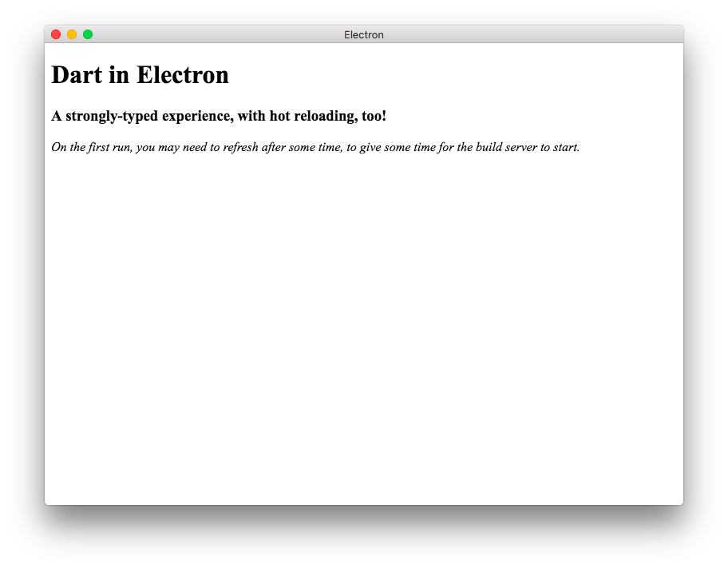

# dart_electron_starter_kit
Boilerplate project for building Electron apps with Dart.
This starter kit is minimal, and only contains what you need to get started
right away.



## Setup
Assuming you have both `npm` (or `yarn`) and the Dart SDK installed, setup is simple:

```bash
git clone https://github.com/thosakwe/dart_electron_starter_kit [project-name]
cd [project-name]
pub get
npm install
```

Afterwards, run `npm run dev` to start developing.

## Development
This package uses `package:build_web_compilers` and the Dart Dev Compiler to compile a Dart app to JS on-the-fly.
Thanks to, `package:build_runner`, this allows for incremental builds, **and**
[hot-reloading](https://github.com/dart-lang/build/blob/master/docs/hot_module_reloading.md).

Now, you can write your Electron app with Dart, leveraging existing JS interop libraries, and, of course,
other Dart packages.
 
## Release
To build for production, first run `npm run build` (or `yarn build`).

The output directory, `build/web/` contains a `package.json` pointing to the built
application, and can be run as follows:

```bash
cd build/web
npm install
npm start
```

### Packaging
The output directory's package manifest, `build/web/package.json`, includes
[`electron-packager`](https://github.com/electron-userland/electron-packager),
and therefore can be packaged for distribution on Windows, MacOS, and Linux.

Just run `npm run package`.